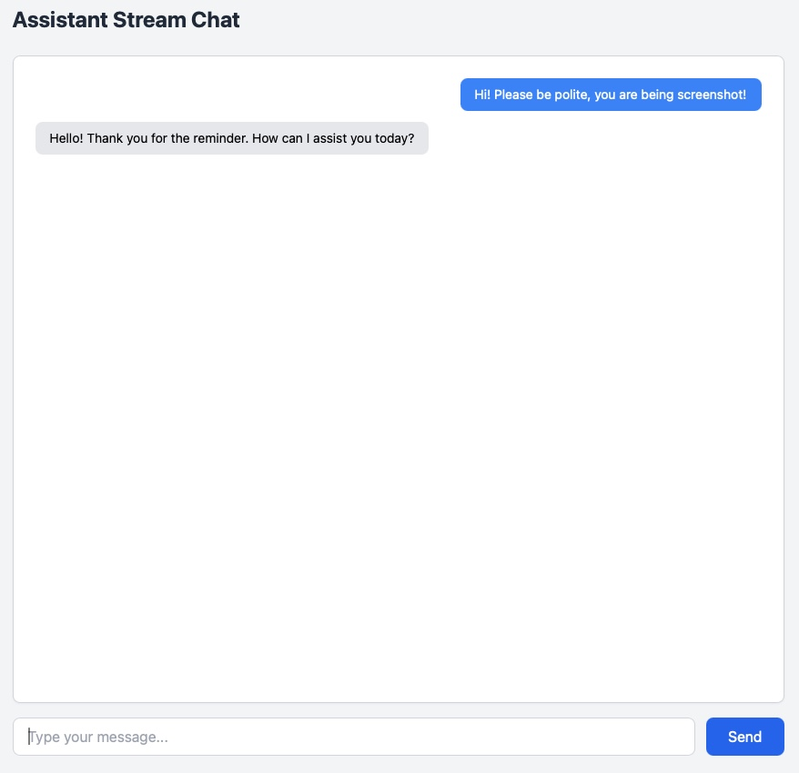

# OpenAI Assistant API Streaming Example with Flask

This project demonstrates how to implement streaming responses from OpenAI's Assistant API using Flask. While there are many examples of streaming with Chat Completions API, the Assistant API works differently and requires a different implementation approach.



## Why This Project Exists

The OpenAI Assistant API is powerful but implementing streaming with it can be tricky. Most examples online show streaming with the Chat Completions API, but the Assistant API:
- Uses a different endpoint structure
- Requires thread management
- Has a different streaming response format

This project provides a minimal, working example of how to properly implement streaming with the Assistant API.

## Prerequisites

- Python 3.8 or newer
- An OpenAI API key
- An existing OpenAI Assistant (you need its ID)

## Installation

1. Clone the repository:

```bash
git clone https://github.com/yourusername/openai-assistant-streaming.git
cd openai-assistant-streaming
```

2. Create and activate a virtual environment:

```bash
python -m venv venv
```
On Windows:

```venv\Scripts\activate```

On macOS/Linux:

```source venv/bin/activate
```

    ```bash
    python -m venv venv
    source venv/bin/activate
    ```

3. Install the required dependencies:

    ```bash
    pip install -r requirements.txt
    ```

4. Create your environment file:

```bash
# Copy the example env file
cp .env.example .env
```

5. Configure your environment:
   - Open `.env` in your text editor
   - Add your OpenAI API key
   - Add your Assistant ID
   - Adjust other settings if needed

## Creating an Assistant

If you haven't created an Assistant yet:

1. Go to [OpenAI Platform](https://platform.openai.com/assistants)
2. Create a new Assistant
3. Copy the Assistant ID (you'll need this for your .env file)

## Running the Application

1. Start the Flask application:
```bash
flask run
```

2. Open your browser and navigate to:
```
http://localhost:5000
```

## Project Structure

```
.
├── main.py              # Flask application setup
├── config.py            # Configuration handling
├── routes/
│   └── assistant.py     # API routes
├── services/
│   └── assistant_service.py  # Assistant API integration
└── templates/
    └── stream.html      # Frontend chat interface
```

## Key Features

- Real-time streaming of Assistant responses
- Simple, clean UI with Tailwind CSS
- Minimal dependencies
- Clear separation of concerns
- Easy to understand and modify

## Common Issues

1. If you see "No module named 'openai'":
   ```bash
   pip install openai
   ```

2. If your Assistant isn't responding:
   - Check your API key
   - Verify your Assistant ID
   - Ensure your OpenAI account has available credits

## Contributing

Feel free to open issues or submit pull requests if you have suggestions for improvements.

## License

MIT License - feel free to use this code in your own projects.

### Documentation

OpenAI Assistant API Reference can be found here: https://platform.openai.com/docs/api-reference/assistants

### Contributors

This repo is provided by [Tero Rönkkö](https://www.linkedin.com/in/tero-ronkko/)
This code is based on work of various authors, including Jean-Charles Risch and many others.
